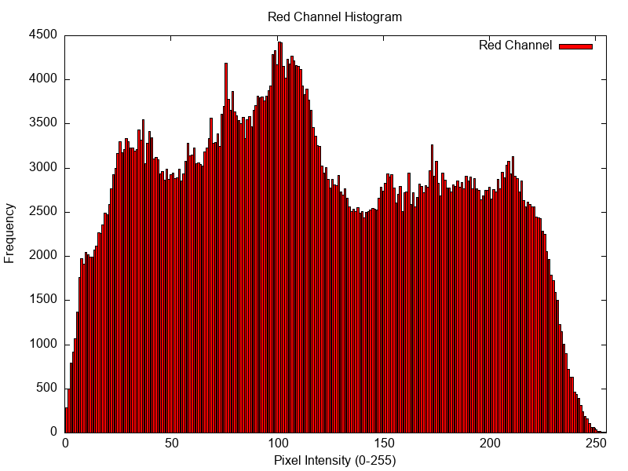
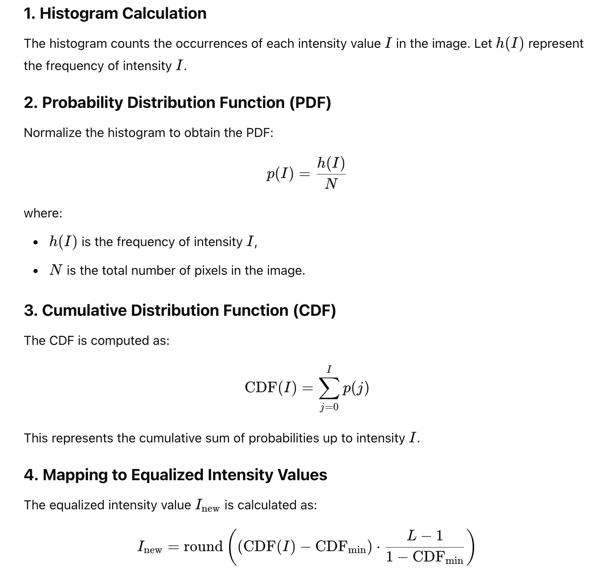
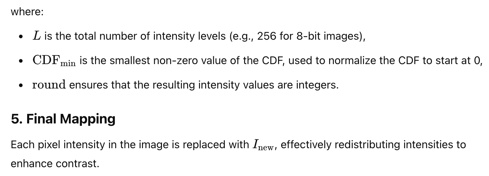

# Image Histogram with C Language

This is a simple C program that generates a histogram from an input image. It uses the stb_image and stb_image_write libraries for image loading, manipulation, and saving. For plotting the histogram, GNUPlot is used. 
<br>
Some part of the code is taken from https://github.com/pjreddie/vision-hw0 repository and modified.

## Setup

There is no need any setup. Just clone the repository and run the Makefile.
The tech stack of the project is
 - C Language (your favorite C compiler)
 - GNUPlot
 - Makefile

## Usage

Makefile is provided to build and run the program.

```bash
    make
    # or
    make -j 4
```

This step will compile the program and create an executable file named "main".

```bash
    make run
```

This will load an image, generate a histogram for each channel and grayscale. You can change the image path in the main.c file to use a different image.

```bash
    make plot
```

This will plot the histograms for each channel and grayscale using GNUPlot.


## Expected Output

<table>
  <tr>
    <td align="center">
      <br>
      <em>Original Image</em>
    </td>
    <td align="center">
      <br>
      <em>Grayscale Image</em>
    </td>
  </tr>
  <tr>
    <td align="center">
      <br>
      <em>Original Image</em>
    </td>
    <td align="center">
      <br>
      <em>Grayscale Image</em>
    </td>
  </tr>
</table>

## Histogram Equalization

ChatGPT was kind enough to explain the math behind histogram equalization.


<br>


## Contributing
If you'd like to contribute, please fork the repository and use a feature branch. Pull requests are warmly welcome.
