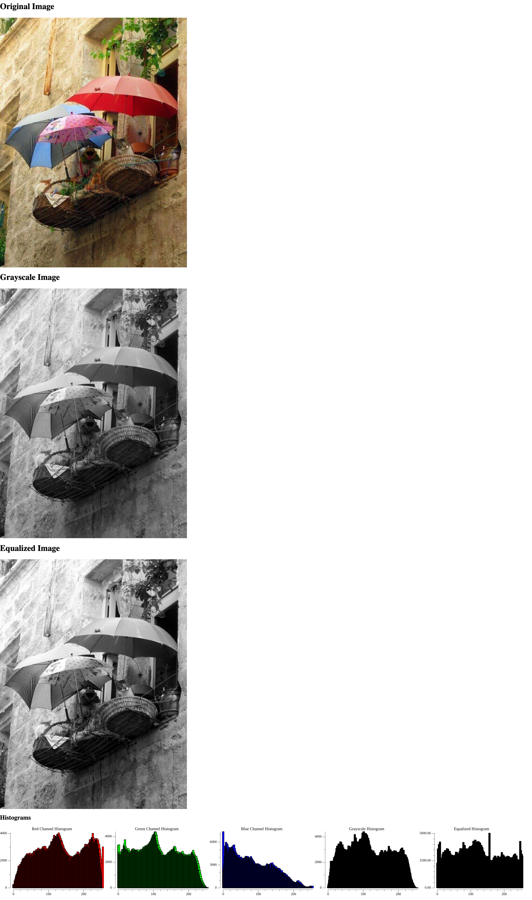

# Image Histogram with Go

This is a simple Go application that generates a histogram of an image. It uses the image and plot packages for image processing and plotting the histogram. The application also uses the http package to render the histograms in a web browser.

## Setup

```bash
    go mod init image-histogram
    go mod tidy
```
After setting up the required modules, you can install the required packages using the following command:

```bash
    go get
```

This command will install all the packages that needed for this program.

## Usage

Run the main.go script:

```bash
    go run main.go
    # or
    go build
    ./image-histogram
```

This will load a provided image, generate a histogram, and display the histogram plot in a web browser. You can change the image path in the main.go file to use a different image.

## Expected Output

The application will render a web page with the original image, grayscale image, equalized image, and histograms for the red, green, blue, grayscale, and equalized channels.



_This project is tested on Linux Ubuntu 22.04 and MacOs Sonoma. If you encounter any issues, please open an issue._

## Contributing
If you'd like to contribute, please fork the repository and use a feature branch. Pull requests are warmly welcome.
