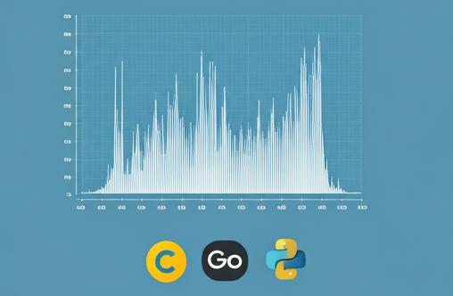
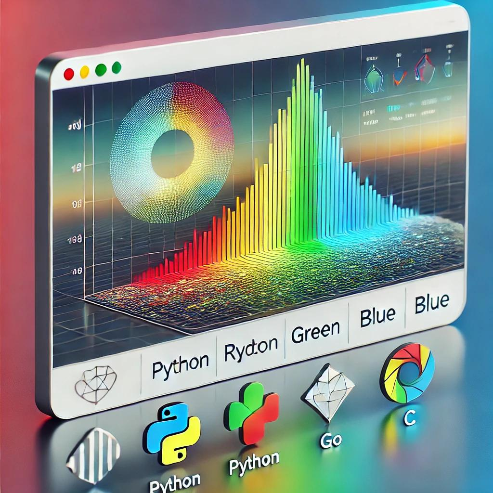
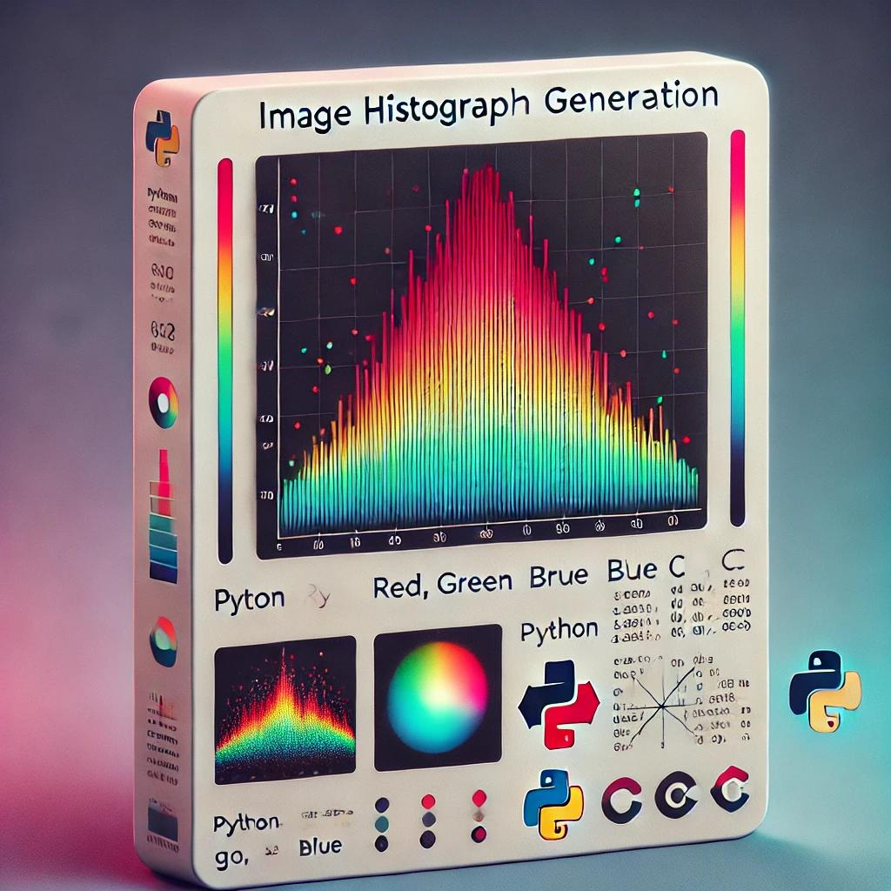

# Image Histogram on Three Languages C, Go, and Python

  

|||
|-------------------|------------------------|
|  |  |

This repository contains three implementations of an image histogram application in C, Go, and Python. Each implementation generates a histogram of an image and displays the histogram plot for individual channels or grayscale image.

## Setup

Each implementation has its own setup instructions. Please refer to the respective README files for each language:

- [C Implementation](C/README.md)
- [Go Implementation](Go/README.md)
- [Python Implementation](Python/README.md)

## Usage

Each implementation has its own usage instructions. Please refer to the respective README files for each language:

- [C Implementation](C/README.md)
- [Go Implementation](Go/README.md)
- [Python Implementation](Python/README.md)

## Expected Output

Each implementation will generate a histogram plot for the individual channels or grayscale image. The expected output will vary depending on the input image and the implementation used. Please refer to the respective README files for each language for more details.

_This project is tested on Linux Ubuntu 22.04 and MacOs Sonoma. If you encounter any issues, please open an issue._

## Contributing

If you'd like to contribute, please fork the repository and use a feature branch. Pull requests are warmly welcome.
